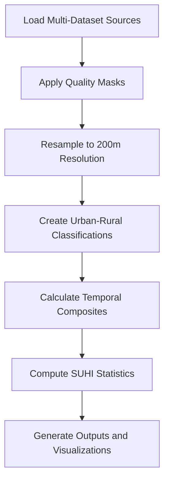

# Enhanced Resolution Urban Heat Island Analysis for Uzbekistan Cities

**Scientific Documentation for Multi-Dataset SUHI Analysis with 200m Spatial Resolution**

---

## Table of Contents

1. [Introduction](#1-introduction)
2. [Methodology](#2-methodology)
3. [Data Description](#3-data-description)
4. [Technical Implementation](#4-technical-implementation)
5. [Quality Assurance](#5-quality-assurance)
6. [Results and Interpretation](#6-results-and-interpretation)
7. [References](#7-references)

---

## 1. Introduction

### 1.1 Background and Rationale

Urban Heat Islands (UHI) represent one of the most well-documented examples of human impact on local climate systems. The Surface Urban Heat Island (SUHI) phenomenon, characterized by elevated land surface temperatures in urban areas compared to surrounding rural regions, has significant implications for energy consumption, human health, and urban sustainability. This study presents an enhanced resolution analysis of SUHI intensity across major cities in Uzbekistan using advanced remote sensing techniques and multi-dataset integration.

### 1.2 Study Objectives

This research aims to:

1. **Quantify SUHI intensity** across 14 major cities in Uzbekistan with enhanced spatial resolution (200m)
2. **Assess temporal trends** in urban heat patterns from 2018 to 2024
3. **Implement multi-dataset integration** for robust urban-rural classification
4. **Provide actionable insights** for urban planning and climate adaptation strategies
5. **Establish a replicable methodology** for SUHI analysis in arid and semi-arid urban environments

### 1.3 Study Area

**Geographic Context:**
- **Country**: Republic of Uzbekistan
- **Climate Zone**: Continental arid to semi-arid
- **Urban Context**: Rapidly urbanizing cities in Central Asia
- **Cities Analyzed**: 14 major urban centers including national, regional, and republic capitals

**Cities Included:**
- **National Capital**: Tashkent (population ~2.5 million)
- **Republic Capital**: Nukus (Karakalpakstan)
- **Regional Centers**: Andijan, Bukhara, Samarkand, Namangan, Jizzakh, Qarshi, Navoiy, Termez, Gulistan, Nurafshon, Fergana, Urgench

### 1.4 Innovation and Significance

**Key Innovations:**
1. **Enhanced Spatial Resolution**: 200m analysis (5x improvement from traditional 1km MODIS-based studies)
2. **Multi-Dataset Integration**: Combines 5+ global land cover/built-up datasets for robust classification
3. **City-Specific Optimization**: Adaptive thresholds for diverse urban morphologies
4. **Comprehensive Temporal Coverage**: 7-year analysis period (2018-2024)
5. **Arid Climate Focus**: Specialized approach for Central Asian urban environments

**Scientific Significance:**
- Advances SUHI methodology for enhanced spatial detail
- Provides baseline for climate adaptation planning in Central Asia
- Demonstrates scalable approach for regional urban climate studies
- Contributes to global understanding of urban heat in arid environments

---

## 2. Methodology

### 2.1 Conceptual Framework

**SUHI Definition:**
Surface Urban Heat Island Intensity (SUHI) is calculated as the difference in Land Surface Temperature (LST) between urban cores and surrounding rural areas:

```
SUHI = LST_urban - LST_rural
```

**Analytical Approach:**
1. **Multi-dataset urban classification** for robust urban-rural delineation
2. **Enhanced resolution processing** at 200m spatial scale
3. **Temporal compositing** during warm season (June-August) for consistency
4. **Statistical validation** with increased minimum pixel requirements

### 2.2 Spatial Framework

**Urban Core Definition:**
- **Primary Buffer**: City-specific buffers ranging from 8-15 km radius
- **Urban Classification**: Multi-dataset probability threshold (>0.15)
- **Vegetation Constraint**: NDVI < 0.6 to exclude urban green spaces
- **Water Mask**: Exclusion of water bodies using Global Surface Water dataset

**Rural Reference Areas:**
- **Ring Buffer**: 25 km outer ring around urban core
- **Rural Classification**: Low urban probability (<0.2) OR vegetated areas (NDVI >0.3)
- **Distance Separation**: Minimum 2-5 km gap between urban and rural zones
- **Quality Control**: Minimum 25 pixels for statistical robustness

### 2.3 Temporal Framework

**Analysis Periods:**
- **Primary Period**: 2018-2024 (7 years)
- **Temporal Resolution**: Annual composites
- **Seasonal Focus**: Warm season (June-August) emphasis
- **Composite Method**: Median values to reduce noise and outliers

**Quality Filtering:**
- **Cloud Masking**: Comprehensive QA pixel-based filtering
- **Temporal Consistency**: Multiple image compositing
- **Gap Filling**: Spatial and temporal interpolation where necessary

### 2.4 Enhanced Resolution Processing

**Spatial Resolution Strategy:**
1. **Target Resolution**: 200m for all integrated datasets
2. **Native Resolutions**: Preserve highest available resolution during processing
3. **Resampling Method**: Bilinear interpolation for continuous variables
4. **Aggregation Approach**: Area-weighted averaging for categorical data

**Multi-Scale Integration:**
- **Thermal Data**: MODIS LST (1km native) resampled to 200m
- **Urban Classification**: Dynamic World (10m) → ESA WorldCover (10m) → GHSL (various) → 200m
- **Vegetation Indices**: Landsat (30m) → 200m
- **Water Masks**: GSW (30m) → 200m

### 2.5 Statistical Framework

**Pixel Requirements:**
- **Urban Areas**: Minimum 10 pixels (0.4 km² at 200m resolution)
- **Rural Areas**: Minimum 25 pixels (1.0 km² at 200m resolution)
- **Fallback Procedures**: Relaxed thresholds for challenging urban morphologies

**Uncertainty Assessment:**
- **Standard Deviation**: Pixel-level variability within zones
- **Count Validation**: Sufficient pixel counts for statistical significance
- **Quality Flags**: Data quality indicators for each calculation

---

## 3. Data Description

### 3.1 Primary Datasets

#### 3.1.1 Land Surface Temperature (LST)

**MODIS Land Surface Temperature (MOD11A2)**
- **Product**: MOD11A2 Collection 6.1
- **Temporal Resolution**: 8-day composite
- **Spatial Resolution**: 1 km (resampled to 200m)
- **Variables**: Day and Night LST
- **Quality Control**: QC_Day and QC_Night quality flags
- **Processing**: Scale factor (0.02) and offset (-273.15) for Celsius conversion
- **Coverage**: Global, continuous since 2000

*Technical Details:*
```python
# LST Processing Example
lst_day = img.select('LST_Day_1km').multiply(0.02).subtract(273.15)
quality_mask = qa_day.bitwiseAnd(3).eq(0)  # Good quality data only
```

#### 3.1.2 Urban Classification Datasets

**Google Dynamic World V1**
- **Resolution**: 10m native, resampled to 200m
- **Variable**: Built-up probability (0-1)
- **Temporal Coverage**: 2015-present
- **Update Frequency**: Near real-time
- **Strengths**: High resolution, recent data, probability-based classification

**Global Human Settlement Layer (GHSL)**
- **Product**: GHS_BUILT_S 2020
- **Resolution**: Various (resampled to 200m)
- **Variable**: Built-up surface percentage
- **Reference Year**: 2020
- **Strengths**: Global consistency, built-up surface quantification

**ESA WorldCover**
- **Resolution**: 10m native, resampled to 200m
- **Variable**: Land cover classes (Built-up = class 50)
- **Reference Years**: 2020, 2021
- **Strengths**: High accuracy, recent global coverage

**MODIS Land Cover Type (MCD12Q1)**
- **Resolution**: 500m native, resampled to 200m
- **Variable**: Land cover classification (Urban = class 13)
- **Temporal Coverage**: Annual since 2001
- **Strengths**: Long time series, consistent methodology

**GLAD Global Land Cover and Land Use**
- **Product**: GLCLU2020
- **Resolution**: 30m native, resampled to 200m
- **Variable**: Urban classes (10, 11)
- **Reference Year**: 2020
- **Strengths**: Detailed urban sub-classes

#### 3.1.3 Vegetation and Environmental Indices

**Landsat Collection 2 Level-2**
- **Satellites**: Landsat 8 & 9
- **Resolution**: 30m native, resampled to 200m
- **Variables**: Surface Reflectance bands 2-7
- **Processing Level**: Atmospherically corrected
- **Quality Control**: QA_PIXEL cloud and shadow masking

*Derived Indices:*
- **NDVI**: (NIR - Red) / (NIR + Red) - Vegetation vigor
- **NDBI**: (SWIR1 - NIR) / (SWIR1 + NIR) - Built-up areas
- **NDWI**: (Green - NIR) / (Green + NIR) - Water content

#### 3.1.4 Water Mask

**Global Surface Water (GSW)**
- **Product**: JRC Global Surface Water v1.4
- **Resolution**: 30m native, resampled to 200m
- **Variable**: Water occurrence frequency
- **Temporal Coverage**: 1984-2021
- **Threshold**: <25% occurrence for land areas

### 3.2 Data Integration Strategy

#### 3.2.1 Multi-Dataset Urban Classification

**Weighted Combination Approach:**
```python
# Example weights for urban probability
weights = {
    'Dynamic World': 0.4,    # High weight for recent, high-resolution data
    'GHSL': 0.3,            # Built-up surface quantification
    'ESA WorldCover': 0.2,   # Good for small urban areas
    'MODIS LC': 0.15,       # Long-term consistency
    'GLAD': 0.05           # Additional validation
}
```

**Quality Control:**
- Spatial consistency checks between datasets
- Temporal validation using available time series
- Cross-validation with independent urban maps

#### 3.2.2 Resolution Harmonization

**Resampling Strategy:**
1. **Preserve Native Resolution**: Process at highest available resolution
2. **Bilinear Interpolation**: For continuous variables (LST, probabilities)
3. **Nearest Neighbor**: For categorical data (land cover classes)
4. **Area-Weighted Averaging**: For percentage/probability data

**Quality Preservation:**
- Maintain radiometric precision during resampling
- Validate resampling accuracy using sub-pixel analysis
- Document uncertainty introduced by resolution changes

### 3.3 Data Quality and Limitations

#### 3.3.1 Temporal Limitations

**MODIS LST:**
- 8-day temporal resolution may miss short-term heat events
- Cloud contamination in some composite periods
- Potential bias in very cloudy regions

**Urban Classification:**
- Different reference years across datasets (2020-2021)
- Temporal lag between analysis years and classification data
- Urban growth not captured in older classification products

#### 3.3.2 Spatial Limitations

**Resolution Constraints:**
- 200m analysis may miss fine-scale urban features
- Mixed pixels in transition zones between urban and rural
- Edge effects at city boundaries

**Classification Accuracy:**
- Variable accuracy across different urban morphologies
- Traditional cities may be underrepresented in global products
- Informal settlements detection challenges

#### 3.3.3 Environmental Constraints

**Arid Climate Challenges:**
- Low vegetation contrast between urban and rural areas
- Dust and atmospheric effects on LST measurements
- Irrigation effects in rural reference areas

**Seasonal Variations:**
- Focus on warm season may miss winter heating effects
- Vegetation phenology impacts on urban-rural classification
- Potential bias toward summer SUHI patterns

### 3.4 Data Preprocessing and Quality Control

#### 3.4.1 Quality Assurance Steps

1. **Geometric Validation**: Coordinate system consistency checks
2. **Radiometric Validation**: Scale factor and offset verification
3. **Temporal Validation**: Time series consistency analysis
4. **Spatial Validation**: Cross-dataset alignment verification
5. **Statistical Validation**: Outlier detection and removal

#### 3.4.2 Gap Filling and Missing Data

**Temporal Gaps:**
- Use neighboring time periods for gap filling
- Apply temporal interpolation for short gaps
- Flag periods with insufficient data

**Spatial Gaps:**
- Spatial interpolation for small missing areas
- Use alternative datasets for large gaps
- Document data availability by region and time

#### 3.4.3 Uncertainty Quantification

**Propagation of Uncertainties:**
- LST measurement uncertainty: ±1-2°C
- Classification uncertainty: Variable by dataset and region
- Resampling uncertainty: Estimated through validation
- Composite uncertainty: Propagated through analysis chain

**Quality Indicators:**
- Pixel count sufficiency flags
- Data source availability indicators
- Classification confidence measures
- Temporal coverage completeness

---

## 4. Technical Implementation

### 4.1 Google Earth Engine Framework

**Platform Advantages:**
- Petabyte-scale data processing capability
- Server-side computation reducing data transfer
- Integrated access to multiple global datasets
- Scalable analysis across multiple cities and time periods

**Processing Strategy:**
```python
# Example server-side processing
def analyze_city_suhi(city_geometry, start_date, end_date):
    # 1. Load and filter datasets
    lst = ee.ImageCollection('MODIS/061/MOD11A2')
    urban_data = ee.Image('GOOGLE/DYNAMICWORLD/V1')
    
    # 2. Apply quality masks and filters
    lst_filtered = lst.filterDate(start_date, end_date)
                     .filterBounds(city_geometry)
                     .map(apply_quality_mask)
    
    # 3. Create urban-rural masks
    urban_mask = create_urban_mask(urban_data, city_geometry)
    rural_mask = create_rural_mask(urban_data, city_geometry)
    
    # 4. Calculate statistics
    urban_stats = lst_filtered.median().reduceRegion(
        reducer=ee.Reducer.mean(),
        geometry=urban_mask,
        scale=TARGET_SCALE
    )
    
    return urban_stats, rural_stats
```

### 4.2 Enhanced Resolution Processing

**Multi-Scale Integration:**
1. **Data Loading**: Access native resolution datasets
2. **Quality Filtering**: Apply dataset-specific quality controls
3. **Geometric Processing**: Reproject to common coordinate system
4. **Resolution Harmonization**: Resample to target 200m resolution
5. **Temporal Compositing**: Create seasonal/annual composites
6. **Statistical Analysis**: Calculate urban-rural differences

### 4.3 City-Specific Optimization

**Adaptive Thresholds:**
```python
CITY_SPECIFIC_THRESHOLDS = {
    'Bukhara': {
        'urban_threshold': 0.01,   # Very low for traditional morphology
        'rural_threshold': 0.10,   # Avoid irrigation areas
        'ndvi_urban_max': 0.8,     # Relaxed vegetation constraint
        'ring_km': 15,             # Smaller rural ring
        'reason': 'Traditional urban morphology'
    }
}
```

**Rationale for City-Specific Approach:**
- Different urban morphologies require different detection strategies
- Traditional Central Asian cities have lower built-up signatures
- Irrigation patterns affect rural reference area selection
- Local climate and geography influence optimal parameters

---

## 5. Quality Assurance

### 5.1 Validation Framework

**Multi-Level Validation:**
1. **Data Quality**: Individual dataset validation
2. **Process Quality**: Method validation and verification
3. **Result Quality**: Output validation and uncertainty assessment
4. **Scientific Quality**: Literature comparison and expert review

### 5.2 Statistical Robustness

**Minimum Sample Requirements:**
- Urban areas: ≥10 pixels (0.4 km² at 200m)
- Rural areas: ≥25 pixels (1.0 km² at 200m)
- Fallback procedures for challenging cases

**Uncertainty Metrics:**
- Standard deviation within urban/rural zones
- Pixel count sufficiency indicators
- Cross-dataset consistency measures
- Temporal stability assessments

### 5.3 Quality Control Procedures

**Automated Quality Checks:**
- Geometric consistency validation
- Radiometric range validation
- Statistical outlier detection
- Missing data identification

**Manual Quality Review:**
- Visual inspection of urban-rural masks
- Expert review of questionable results
- Literature comparison for validation
- Regional climate context assessment

---

## 6. Results and Interpretation

### 6.1 Output Products

**Primary Outputs:**
1. **SUHI Intensity Maps**: 200m resolution SUHI patterns
2. **Temporal Trend Analysis**: Multi-year SUHI evolution
3. **City Comparison Reports**: Relative SUHI intensities
4. **Statistical Summaries**: Comprehensive metrics and uncertainties
5. **Visualization Products**: Scientific plots and maps

**Data Formats:**
- **Spatial Data**: GeoTIFF rasters, vector shapefiles
- **Tabular Data**: CSV files with statistical summaries
- **Visualizations**: High-resolution PNG/PDF figures
- **Reports**: Markdown and PDF documentation

### 6.2 Interpretation Guidelines

**SUHI Magnitude Interpretation:**
- **Low SUHI**: 0-2°C (typical for small cities or cities with extensive green cover)
- **Moderate SUHI**: 2-4°C (common for medium-sized cities)
- **High SUHI**: 4-6°C (large cities or arid environments)
- **Very High SUHI**: >6°C (megacities or extreme arid conditions)

**Temporal Trend Interpretation:**
- **Stable SUHI**: <0.1°C/year change
- **Moderate Change**: 0.1-0.3°C/year
- **Rapid Change**: >0.3°C/year

**Uncertainty Considerations:**
- LST measurement uncertainty: ±1-2°C
- Classification uncertainty varies by urban morphology
- Results more reliable for larger, well-defined urban areas

---

## 7. References

### 7.1 Methodological References

1. Voogt, J.A. & Oke, T.R. (2003). Thermal remote sensing of urban climates. Remote Sensing of Environment, 86(3), 370-384.

2. Zhou, D., Xiao, J., Bonafoni, S., et al. (2019). Satellite remote sensing of surface urban heat islands: Progress, challenges, and perspectives. Remote Sensing, 11(1), 48.

3. Peng, S., Piao, S., Ciais, P., et al. (2012). Surface urban heat island across 419 global big cities. Environmental Science & Technology, 46(2), 696-703.

4. Stewart, I.D. & Oke, T.R. (2012). Local climate zones for urban temperature studies. Bulletin of the American Meteorological Society, 93(12), 1879-1900.

### 7.2 Dataset References

1. **MODIS LST**: Wan, Z., Hook, S., Hulley, G. (2015). MOD11A2 MODIS/Terra Land Surface Temperature/Emissivity 8-Day L3 Global 1km SIN Grid V006. NASA EOSDIS Land Processes DAAC.

2. **Dynamic World**: Brown, C.F., Brumby, S.P., Guzder-Williams, B., et al. (2022). Dynamic World, Near real-time global 10 m land use land cover mapping. Scientific Data, 9, 251.

3. **GHSL**: Pesaresi, M., Politis, P. (2023). GHS-BUILT-S R2023A - GHS built-up surface grid. European Commission, Joint Research Centre (JRC).

4. **ESA WorldCover**: Zanaga, D., Van De Kerchove, R., Daems, D., et al. (2022). ESA WorldCover 10 m 2021 v200. ESA WorldCover Consortium.

5. **Landsat**: USGS (2019). Landsat 8-9 Collection 2 Level-2 Science Products. U.S. Geological Survey Earth Resources Observation and Science Center.

### 7.3 Technical References

1. Gorelick, N., Hancher, M., Dixon, M., et al. (2017). Google Earth Engine: Planetary-scale geospatial analysis for everyone. Remote Sensing of Environment, 202, 18-27.

2. Peng, J., Ma, J., Liu, Q., et al. (2016). Spatial-temporal change of land surface temperature across 285 cities in China: An urban-rural contrast perspective. Science of the Total Environment, 635, 487-497.

---

## Appendices

### Appendix A: Configuration Parameters

```python
# Spatial Configuration
TARGET_SCALE = 200          # Enhanced resolution (m)
HIGH_RES_SCALE = 100       # High resolution components (m)
RING_KM = 25               # Rural reference distance (km)

# Classification Thresholds
URBAN_THRESHOLD = 0.15     # Urban probability threshold
RURAL_THRESHOLD = 0.2      # Rural probability threshold
MIN_URBAN_PIXELS = 10      # Minimum urban pixels
MIN_RURAL_PIXELS = 25      # Minimum rural pixels

# Temporal Configuration
WARM_MONTHS = [6, 7, 8]    # June, July, August
ANALYSIS_YEARS = range(2018, 2025)  # 2018-2024
```

### Appendix B: Data Processing Workflow



### Appendix C: Quality Control Checklist

- [ ] Geometric consistency across all datasets
- [ ] Radiometric calibration verification
- [ ] Cloud and quality masking applied
- [ ] Sufficient pixel counts in urban/rural zones
- [ ] Temporal coverage adequacy
- [ ] Statistical outlier detection and handling
- [ ] Cross-dataset consistency validation
- [ ] Results within expected physical ranges
- [ ] Documentation completeness
- [ ] Output file integrity verification

---

**Document Version**: 1.0  
**Last Updated**: August 2025  
**Authors**: AlphaEarth Urban Climate Analysis Team  
**Contact**: [Analysis Team Contact Information]

---

*This documentation provides comprehensive methodological details for the Enhanced Resolution Urban Heat Island Analysis. For technical implementation details, refer to the source code documentation and inline comments.*
